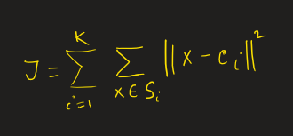
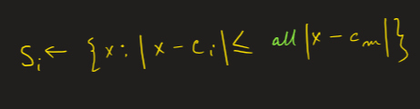
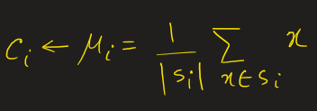

# Kmeans Algorithm


Steps:
- Given a dataset of size `N`, randomly initialize `k` centroids if you feel the dataset can be clustered into `k` different clusters
  
$C = \Set{c_1,..,c_K}$  | Set of `K` Centroids 

$S = \Set{s_1,..,s_K}$  | Set of `K` Clusters 

Intra-cluster variance is the objective function which has to be minimized in k-means algorithm:
    

- Class assignment

    

- Update centroids

    

- Repeat the process until the cluster centroids change any further, i.e. repeat until convergence 

Complexity in one iteration: 
- k *n *t 
 k = K clustures | n = No of samples | t = time taken

 It is sensitive to the randomly chosen centroids 
  
## Clustering performance 

### Silhouette Coefficient 

$$s=\dfrac{b-a}{max(b,a)}$$ 

a : the mean distance between a datapoint and the other points from the same cluster 

b : the mean distance between a datapoint and all the other points in the next nearest cluster. 
!!! Example
    ```python 
    from sklearn import metrics 

    metrics.silhouette_score(data,labels,metric='euclidean')
    # returns the silhouette score
    ```

