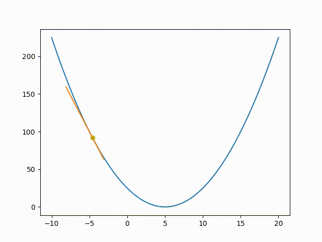

```python
from matplotlib.animation import FuncAnimation as animate
import torch 
from matplotlib import pyplot as plt 


fig, ax = plt.subplots()
f = lambda x : (x-5)**2 
x1 = torch.linspace(-10,20,100)
y1 = f(x1)
w = -5.0
fdashx = lambda x: 2*(x-5)

tangent = lambda x,w : fdashx(w) * (x-w) + f(w)
a = -8.5

lr = 0.01
def sgd(i):
    global w,a
    ydash = fdashx(w)
    w = w - lr*ydash
    a = a - lr*ydash
    y = f(w)
    xs = torch.tensor([a,a+5])
    ax.clear()
    ax.plot(x1,y1)
    ax.plot(xs.numpy(),tangent(xs,w).numpy())
    ax.scatter(w,y,c='y')

plots = animate(fig, sgd, frames=500, interval=10, repeat=False)
plt.show()
```

??? success "output" 
     

```python

fig, ax = plt.subplots()
x1 = torch.linspace(-10,20,100)
y1 = (x1-5)**2

learning_rate = 0.01

x = torch.tensor([-5.0], requires_grad=True)
a=-8.5
optimizer =  torch.optim.SGD([x],lr=learning_rate)
def gradsgd(_):
    optimizer.zero_grad()
    global x,a
    y = lambda x: (x - 5) ** 2
    y(x).backward()
    optimizer.step()
    # grad = x.grad
    tangent_y = lambda a:x.grad*(a-x)+ y(x)

    # with torch.no_grad():
    #     x = x - learning_rate * x.grad
    #     a-= learning_rate*grad.item()
    # x.requires_grad = True
    
    xx = torch.tensor([-10,20])
    ax.clear()
    ax.plot(x1,y1)
    ax.plot(xx,tangent_y(xx).detach().numpy()) 
    ax.scatter(x.detach().numpy(),((x-5)**2).detach().numpy(),c='r')


plots1 = animate(fig, gradsgd, frames=500, interval=10, repeat=False)
plt.show()

```

```python
fig, ax = plt.subplots()
x1 = torch.linspace(-10,20,100)
y1 = (x1-5)**2

learning_rate = 0.01

x = torch.tensor([-5.0], requires_grad=True)

def gradsgd(_):
    global x
    y = (x - 4) ** 2
    y.backward()
    with torch.no_grad():
        x = x - learning_rate * x.grad
        
    x.requires_grad = True
    ax.clear()
    ax.plot(x1,y1)
    ax.scatter(x.detach().numpy(),((x-5)**2).detach().numpy(),c='r')


plots1 = animate(fig, gradsgd, frames=500, interval=10, repeat=False)
plt.show()
```

# Problem with gradient descent 

1. Gradient Descent diverges if $\alpha > 1 $. It also diverges for large learning rate. For small learing rate the learing will be very slow. 

2. GD may not always converges to a global minimum and may stuck to a local minimum.
    
3. It is difficult to determine whether GD has already converged (local/global minimum) or updating very slowly(near a saddle point).

4. GD always escapes saddle point , though may take exponential time.

5. Learning becomes slow if gradient becomes small.

6. Since typically in machine learning we work with enormous amount of data, the cost of a single update is very high. Because we estimate the gradient as an average over all the training points. 

7.  The hyper parameters like learning rate has to be chosen beforehand. It is often difficult to choose the hyper parameters . In very high dimensions it is also better if we can choose different learning rate for different dimensions.

#  How to improve GD ? 

1. Modifying the direction of update by adding a momentum term : Nesterov's Accelerated Gradient descent.

2. Modifying the step size by adaptively choose learning rate for each dimension : AdaGrad

3. By incorporating higher order derivate, like hessian : Newton's method, Quasi Newton's methods like BFGS

4. Estimating the gradient by taking a sample from the data set  : Stochastic Gradient Descent. 