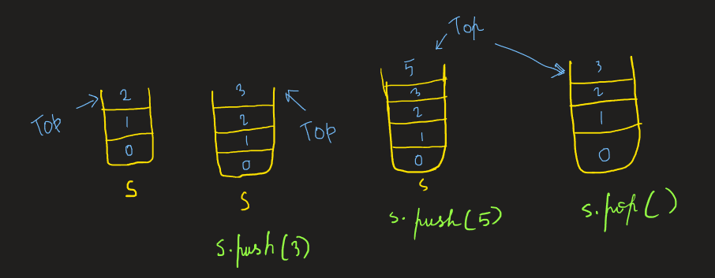

# Stack 

- An ordered list. 
- Deletion and insertion all made at one end i.e., LIFO (last in first out)
- Stack has basic three operations which can be performed on stack, namely `push`, `pop`, and `peek` 
- `push`: to insert an element
- `pop`: to remove the topmost element
- `peek`: to look what's at the top of the stack without removing it
- Every stack operation takes constant time. O(1)

Stacks are usually not dynamic in nature, if implemented using static arrays. But they can be made dynamic using linkedlists or dynamic lists in python. 


To see the implementation of `stack` using `linkedlist` click <a href="https://github.com/GSAUC3/Gsauce-pyds/blob/master/dstructure/stack.py">here</a>.

## How to use a stack in python?
install the data structure library using 
```
pip install Gsauce-pyds
```

!!! Example
    
    ```python
    from dstructure.stack import Stack2

    s = Stack2(range(3))
    print(s,len(s))

    # output:
    # Stack([0,1,2]) 3

    s.push(3)
    s.push(5)
    print(s,len(s))

    # output:
    # Stack([0,1,2,3,5]) 5


    s.pop()
    print(s,len(s))

    # output:
    # Stack([0,1,2,3]) 4

    print(s.peek)
    # 3
    ```

## A few applications of stacks

- Post fix notation 
- Recursion 
- Fibonacci series 
- permutations ...... etc. 
