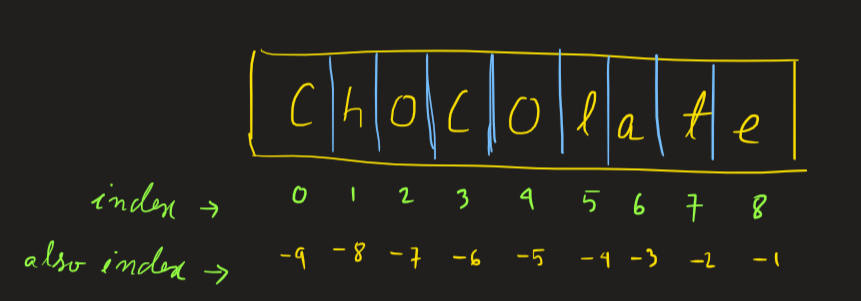

# Strings in python

## How to define a string in python? 
    
There are 4 different ways of doing that, you can use `single quotes`, `double quotes`, `triple quotes`, and `triple-double quotes`!!!  
<span style="color:skyblue">Example</span>:

```python
s = "Traditional way of defining a string"
s1 = 'Easier way of defining the string'
s2 = '''This is another
way of defining a string, in paragraphs'''
s3 = """
"roses are red, 
violets are blue,
if you like forking, 
then you will like Github too."
 - this entire lame poem is also a string, quite long, but a string!
"""
print(s,s1,s2,s3,sep='\n')
```
!!! Output
    ```
    Traditional way of defining a string
    Easier way of defining the string
    This is another
    way of defining a string, in paragraphs

    "roses are red, 
    violets are blue,
    if you like forking, 
    then you will like Github too."
    - this entire lame poem is also a string, quite long, but a string!
    ```
## String Indexing and Slicing

You can access the characters of the string using `+ve` or `-ve` indices.

<span style="color:skyblue">Example</span>:
```python
s = 'chocolate'
print(f'First character: {s[0]}') # this is f-sting**
print(f'Last character: {s[-1]}') 
# s[start index: end index :steps]
#  Using this you can slice a part of a string
print(f'First 3 character: {s[:3]}') 
print(f'Last 3 character: {s[-3:]}') 
```
`s[:3]` is same as `s[0:3]` so you needn't write the starting index.
!!! Output
    First character: c

    Last character: e

    First 3 character: cho
    
    Last 3 character: ate

Now if you want to reverse the string, you can do that using slicing. 
Just set steps to `-1`
```python
print(f'Reverse String is : {s[::-1]}') 
```
!!! Output
    Reverse String is : etalocohc

If you want to take out the middle portion of chocolate then use this:
```python
s = 'chocolate'
print(f'Middle Portion : {s[3:7]}')
```
!!! Output
    Middle Portion : cola

And that's how you extract cola :cup_with_straw: from chocolate :chocolate_bar:
## String concatenation

Want to concatenate multiple strings? LOL! Piece of :cake:. Just use the `+` operator. Like This:
```python
s = "first Name" + "middle name" + 'Last name'
print(s)
```
!!! Output
    first Nameiddle nameLast name

To concatenate same string multiple times use `*`: 
```python
s = 'LOL'*5
print(s)
```
!!! Output
    LOLLOLLOLLOLLOL

## Manipulate your strings:
### <span style="color:Yellow">.replace()</span>
Consider this example:
```python
s = "Angela is my girlfriend"
```
It's been ages with her, she has taken me for granted so I want to replace her. I don't know about real life, but this is easy in python.
```python
s = s.replace('Angela','Anjali') 
# .replace('old substring','new substring')
print(s)
```
!!! Output
    Anjali is my girlfriend

### <span style="color:Yellow">.count()</span>
Returns the frequency of a substring

```python
s ="mi go, mi eat, amigo come, mi again go"
print('Considering the whole string',s.count('mi'),sep='\t')
print(f'Considering only "{s[13:25]}"',s.count('mi',13,25),sep='\t')
```
!!! Output
    Considering the whole string	4

    Considering only ", amigo come"	1

### <span style="color:Yellow">.lower(), .upper(), .swapcase() & .capitalize()</span>

```python
s ="meRRy XmAs"
print(s,s.lower(),s.upper(),s.capitalize(),s.swapcase(),s.title(),sep='\n')
```
!!! Output
    meRRy XmAs   | `original string` 

    merry xmas  | `output of lower()` | `all letters -> lowercase`

    MERRY XMAS | `output of upper()` | `all letters -> uppercase`

    Merry xmas | `output of captalize()` | `only capitalizes the initials of the first word of a string`

    MErrY xMaS | `output of swapcase()` | `self-explanatory`

    Merry Xmas | `output of title()` | `capitalizes all the initials`

### <span style="color:Yellow">.islower(), .isupper(), .isdigit()</span>
```python
print("UPPER".isupper(),'uPPer'.isupper())
        # True          False

print('loWer'.islower(),'lower'.islower())
        # False             True

print('lol'.isdigit(),'92'.isdigit(),'3.4'.isdigit(),'/*-'.isdigit())
#       False               True            False       False
```

### <span style="color:Yellow">.isspace(), .istitle(), .isdecimal()</span>
```python
print('   '.isspace(),'    s   '.isspace())
        # True               False

print('1.2'.isdecimal(),'12'.isdecimal(),'.12'.isdecimal())
        # False          True                False

print('Title Shitel'.istitle(),'title shitel'.istitle(),'titlE'.istitle())
#        True                    False                   False
```


### <span style="color:Yellow">.isnumeric(), .isalpha(), .isalnum()</span>
```python
print('sOmethIng'.isalpha(),'anglepriya420'.isalpha())
                # True           False

print('12'.isnumeric(),'1.2'.isnumeric(),'numeric'.isnumeric())
            # True               False       False

print('aasd233'.isalnum(),'123'.isalnum(),'assert'.isalnum(),'1s#'.isalnum(),'spa ce'.isalnum())
        # True              True          True                     False       False

```
### <span style="color:Yellow">.endswith(), .startswith()</span>
```python
filename = 'unnecessary.csv'
print(filename.endswith('.csv'),filename.endswith('.CSV'))

```
!!! Output
     True          False

```python
print('Miss Hitler'.startswith('Miss'))
            # True
print('Miss Hitler'.startswith('miss'))
            # False
print('Miss Hitler'.lower().startswith('miss'))
            # True
```

### <span style="color:Yellow">.split(), .join()</span>

`split()` method splits the string on the basis of a delimiter, provided by the user. returns a list of words.

By default the delemiter is set to `' '`.

<span style="color:skyblue">Example</span> 1
```python
s = 'This is a string'
print(s)
s = s.split()
print(s)
```
!!! output
    This is a string

    ['This', 'is', 'a', 'string']


<span style="color:skyblue">Example</span> 2
```python
s = 'name,age,sex,roll,num'
print(s)
s = s.split(',')
print(s)
```
!!! output
    name,age,sex,roll,num

    ['name', 'age', 'sex', 'roll', 'num']


`.join()` method concatenate all strings of a given iterable( list, tuples,.etc)

<span style="color:skyblue">Example</span>: 
```python
l = ['name', 'age', 'sex', 'roll', 'num']
print(' '.join(l))
```
!!! output
    name age sex roll num

