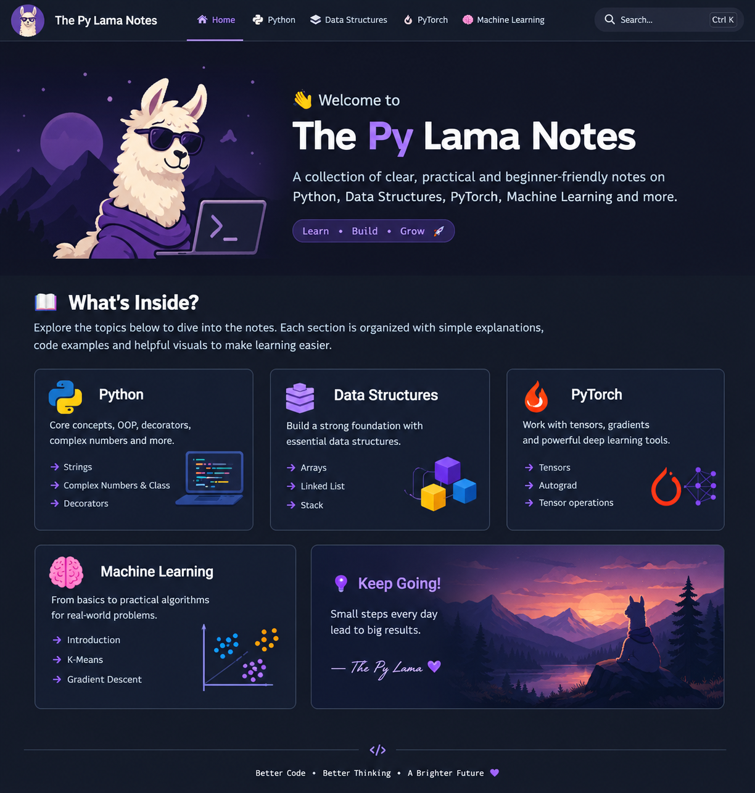

# 🦙 The Py Lama Notes

> **A personal knowledge base for code, mathematics, machine learning, and the beautiful rabbit holes in between.**



---

## 🧠 Learn. Build. Understand.

Welcome to **The Py Lama Notes** — a collection of notes, experiments, explanations, and things I've learned while exploring software engineering, computer science, and machine learning.

The goal isn't just to remember *how* something works.

> ### ✨ Understand **why** it works.

---

## 🐍 Python

Python is where the journey begins.

Learn the language beyond the syntax — from strings and complex numbers to decorators and the little details that make Python interesting.

<div class="grid cards" markdown>

-   ### 🔤 Strings

    Work with strings, slicing, searching, formatting, and useful patterns.

    [:octicons-arrow-right-24: Explore Strings](python/strings.md)

-   ### 🧮 Complex Numbers & Classes

    Explore Python's complex numbers and dive into classes and object-oriented concepts.

    [:octicons-arrow-right-24: Explore](python/complex.md)

-   ### 🎀 Decorators

    Understand decorators from the ground up and see what is actually happening under the hood.

    [:octicons-arrow-right-24: Explore Decorators](python/q.md)

</div>

---

## 🧱 Data Structures

Good algorithms start with understanding the structures they operate on.

<div class="grid cards" markdown>

-   ### 📦 Arrays

    The fundamental building block for many algorithms and problem-solving patterns.

    [:octicons-arrow-right-24: Explore Arrays](data%20structures/arrays/arrays.md)

-   ### 🔗 Linked Lists

    Understand nodes, pointers, traversal, insertion, deletion, and common patterns.

    [:octicons-arrow-right-24: Explore Linked Lists](data%20structures/ll.md)

-   ### 🥞 Stacks

    LIFO, monotonic stacks, expression evaluation, and the patterns that appear in coding interviews.

    [:octicons-arrow-right-24: Explore Stacks](data%20structures/stack.md)

-   ### #️⃣ Hashing

    Hash tables, sets, collisions, lookup complexity, and practical applications.

    [:octicons-arrow-right-24: Explore Hashing](data%20structures/hashing/hashing.md)

</div>

---

## 🔥 PyTorch

From tensors to automatic differentiation, understand the machinery behind modern deep learning.

<div class="grid cards" markdown>

-   ### 🔢 Tensors

    Learn the fundamental data structure behind PyTorch.

    [:octicons-arrow-right-24: Explore Tensors](pytorch/tensor.md)

-   ### ∇ Autograd

    Understand computational graphs, gradients, and automatic differentiation.

    [:octicons-arrow-right-24: Explore Autograd](pytorch/grad.md)

-   ### ⚙️ Tensor Operations

    Broadcasting, reshaping, indexing, matrix operations, and more.

    [:octicons-arrow-right-24: Explore Operations](pytorch/tensor1.md)

</div>

---

## 🤖 Machine Learning

Mathematics → algorithms → intuition → implementation.

<div class="grid cards" markdown>

-   ### 🌱 Introduction

    Build the foundations of machine learning and understand the terminology.

    [:octicons-arrow-right-24: Start Here](ML/intro.md)

-   ### 🎯 K-Means

    Explore clustering through intuition, mathematics, and implementation.

    [:octicons-arrow-right-24: Explore K-Means](ML/kmeans.md)

-   ### 📉 Gradient Descent

    See how optimization turns a mathematical objective into a learning algorithm.

    [:octicons-arrow-right-24: Explore Gradient Descent](ML/sgd.md)

</div>

---

## 🧪 Experiments

Not everything belongs in a textbook.

Some of the most interesting things come from simply asking:

**"What happens if I try this?"**

```python
for idea in ideas:
    experiment(idea)
    learn_from_failure()
    repeat()
```

---

## 🗺️ What's Coming?

The notes are always evolving.

- 🧠 **Algorithms & Problem Solving**
- 🌳 **Trees & Graphs**
- 🔍 **Binary Search**
- 🧮 **Linear Algebra**
- 📐 **Calculus**
- 🧠 **Deep Learning**
- 🐼 **Pandas**
- 🎸 **Music & Mathematics**
- 🛠️ **Random experiments**

---

!!! tip "A small reminder"

    You don't need to understand everything immediately.

    **Read → Think → Implement → Break it → Fix it → Understand it.**

---

<div align="center">

### 🦙 Keep exploring.

**Better Code • Better Thinking • A Brighter Future**

</div>
